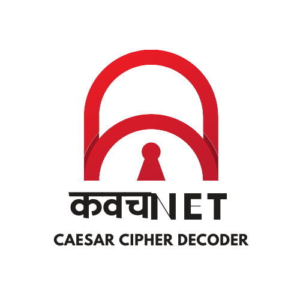

# कवचNet (KavachNet) - Advanced Cipher Decryption Extension



## Overview
कवचNet is a powerful browser extension designed for advanced cipher decryption with an intelligent detection system. Built with a focus on user experience and cybersecurity aesthetics, it provides a seamless interface for decoding encrypted messages.

## Features

### Core Functionality
- 🔐 Automatic Caesar Cipher Detection
- 📊 Intelligent Scoring Algorithm
- 🔄 Real-time Decryption
- 📋 Clipboard Integration
- ⌨️ Keyboard Shortcuts

### Technical Features
- 🎯 26 Shift Variations Analysis
- 📈 English Language Pattern Recognition
- 🧮 Frequency Analysis
- 🎨 Matrix-style Background Animation
- 💫 Cybersecurity-themed UI

## Installation

1. Clone this repository:
```bash
git clone https://github.com/SrishantKumar/KavachNet-ChromeExtension.git
cd kavachnet
```

2. Load the extension in Chrome:
   - Open Chrome and navigate to `chrome://extensions/`
   - Enable "Developer mode" in the top right
   - Click "Load unpacked"
   - Select the project directory

## Usage

1. Click the कवचNet extension icon in your browser
2. Enter or paste encrypted text in the input area
3. Click "Decrypt" or use Ctrl/Cmd + Enter
4. View results sorted by confidence score

### Keyboard Shortcuts
- `Ctrl/Cmd + Enter`: Decrypt text
- `Ctrl/Cmd + V`: Paste from clipboard
- `Ctrl/Cmd + C`: Copy decrypted result

## Technical Details

### Decryption Algorithm
The extension uses a sophisticated scoring system based on:
- Letter frequency analysis
- Common English word patterns
- Pattern consistency checks
- Multiple shift attempts (0-25)

### Scoring Metrics
- Letter Frequency (40%)
- Word Pattern Matching (40%)
- Pattern Consistency (20%)

## Project Structure
```
kavachnet/
├── manifest.json        # Extension configuration
├── index.html          # Main popup interface
├── styles/
│   ├── modern.css      # Main styling
│   └── popup.css       # Extension-specific styles
├── js/
│   ├── main.js         # Core interaction logic
│   ├── decryption.js   # Decryption engine
│   └── ciphers/
│       ├── index.js    # Cipher registry
│       └── CaesarCipher.js  # Caesar cipher implementation
└── assets/
    └── logo.png        # Extension logo
```

## Development

### Prerequisites
- Modern web browser (Chrome recommended)
- Basic understanding of JavaScript
- Familiarity with browser extensions

### Local Development
1. Make changes to the source files
2. Reload the extension in Chrome
3. Test functionality in the extension popup

## Contributing
Contributions are welcome! Please feel free to submit a Pull Request.

### Guidelines
1. Follow the existing code style
2. Add comments for complex logic
3. Test thoroughly before submitting
4. Update documentation as needed


## Credits
- Developed by Srishant
- Matrix background animation inspired by The Matrix
- Cybersecurity-themed design elements

## Contact
For questions or suggestions, please reach out to:
Srishant054@gmail.com (mailto:Srishant054@gmail.com)

---
Made with ❤️ by Srishant
